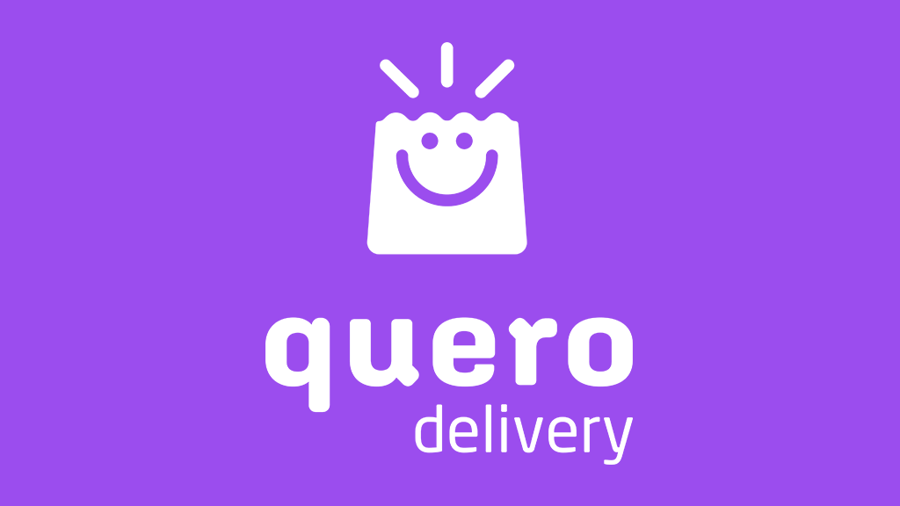
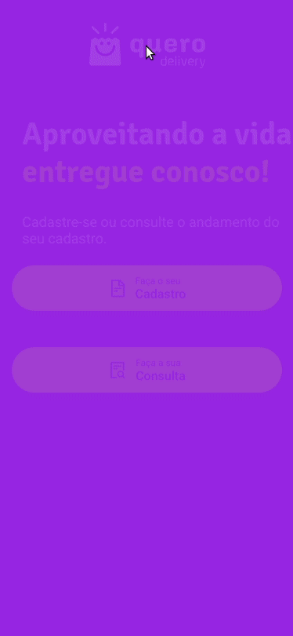
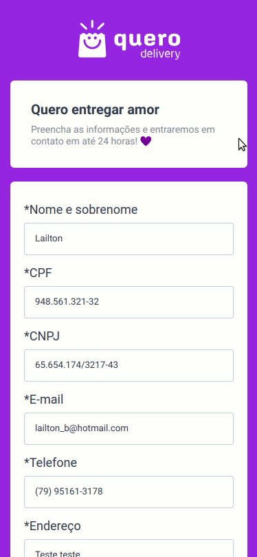
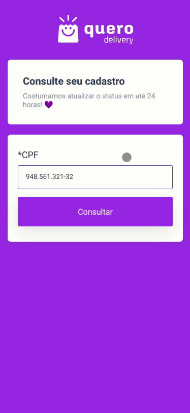

<h1>
Onboarding Motoboys
</h1>
<h2>
Aplicação para cadastro de motoboys
</h2>

Para que seja possível enviar os formulário dessa aplicação é necessário estar rodando o <a href="https://github.com/lailton-b/back_querodelivery">back-end</a> ao mesmo tempo.

 

  

<h2>Página inicial</h2>
 

  

<h2>Cadastro</h2>
 

  

<h2>Consulta</h2>
 

  

  

## Tecnologias

Esse projeto foi desenvolvido com as seguintes tecnologias:

- [ReactJS](https://reactjs.org/)
- [typescript](https://www.typescriptlang.org/)
- [styled-components](https://www.styled-components.com/)
- [react-router-dom](https://reactrouter.com/)
- [react-text-mask](https://www.npmjs.com/package/react-text-mask)
- [react-icons](https://react-icons.github.io/react-icons/)